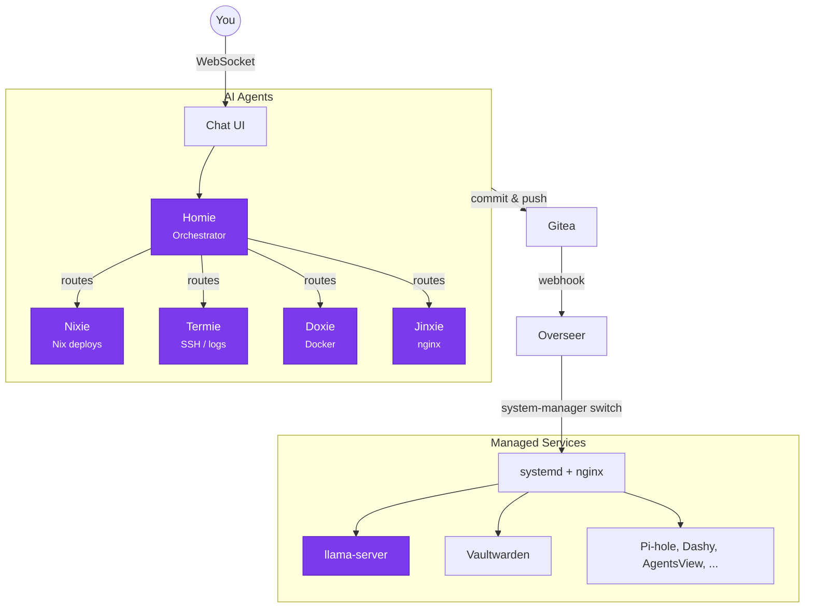

# Homie

A self-assembling homelab that manages itself through AI agents and declarative Nix infrastructure.

Homie is an AI-powered homelab orchestrator. You talk to it through a web chat UI, and it manages your services, deploys changes, debugs issues, and configures infrastructure using specialist agents — each with its own tools and domain expertise. The entire system is declared in Nix, deployed via GitOps, and runs on local LLMs.

## What It Does

- **Chat-driven ops** — Talk to Homie in natural language. It routes requests to specialist agents (Nixie for deploys, Termie for SSH/debugging, Doxie for Docker, Jinxie for nginx).
- **GitOps deployment** — Push to Gitea, the overseer daemon pulls and applies changes via system-manager. No manual SSH.
- **Declarative everything** — All services, ports, nginx routes, and systemd units are defined in `machines/<host>.nix`. One file per machine, one source of truth.
- **Local LLMs** — Runs on llama-server with GGUF models. No cloud API keys needed.
- **Self-evolving** — Homie can propose and deploy infrastructure changes through the same GitOps pipeline it manages.

## Architecture



## Structure

```
machines/        Nix configs per host (the source of truth)
homie/           Web chat UI + specialist agents (TypeScript)
overseer/        Webhook-driven deploy daemon (Python)
packages/        Nix package definitions for third-party services
```

## Prerequisites

- A Linux machine (tested on aarch64 and x86_64)
- [Nix](https://nixos.org/download/) with flakes enabled
- Docker (only for services that can't be Nix-packaged: Pi-hole, Dashy)

## Quick Start

```bash
cd ~
git clone https://github.com/shayarnett/homie.git
cd homie

# Edit machines/spark.nix — change user, hostname, hostIp to match your machine.
# The file is the complete service declaration.

# Deploy all services (first run downloads the LLM model — this takes a few minutes)
nix run 'github:numtide/system-manager' -- switch --flake '.#spark' --sudo
```

After the first deploy:
1. Gitea starts at `gitea.<hostname>.local` — push this repo to it
2. The overseer registers a webhook and handles future deploys automatically
3. Chat with Homie at `chat.<hostname>.local`

## How Deployment Works

1. All services are declared in `machines/<host>.nix` using [system-manager](https://github.com/numtide/system-manager) (not NixOS — works on any Linux distro)
2. Changes are committed and pushed to Gitea
3. The overseer receives a webhook, runs `git pull`, then `system-manager switch`
4. system-manager generates systemd units and nginx configs, restarts changed services

## Default Services

| Service | Description | Default Port |
|---|---|---|
| Homie | Chat UI + agent orchestrator | 3456 |
| Gitea | Git hosting for GitOps deploys | 3000 |
| Overseer | Webhook listener, triggers deploys | 9100 |
| llama-server | Local LLM inference (Qwen3.5) | 8000 |
| Vaultwarden | Password manager (shared vault for infra creds) | 8222 |
| AgentsView | AI session browser | 8085 |
| Pi-hole | DNS with ad blocking (Docker) | 8081 |
| Dashy | Dashboard (Docker) | 8086 |

## Configuration

All configuration lives in `machines/<host>.nix`. Key sections:

- **`ports`** — Port assignments for every service
- **`services.nginx.virtualHosts`** — Reverse proxy routes (auto-generated subdomains)
- **`systemd.services.*`** — Service definitions with start scripts
- **`systemd.tmpfiles.rules`** — Persistent data directories

The Homie webapp reads `~/.homie/config.yaml` for agent model endpoints, service connections, and proxy routes. This file is generated on first deploy by the `gitea-init` oneshot.

## LLM Setup

Homie uses [llama-server](https://github.com/ggml-org/llama.cpp) with GGUF models. The default config uses Qwen3.5-9B for all agents. To set up:

1. Download a GGUF model (e.g., `Qwen3.5-9B-Q4_K_M.gguf`) to your machine
2. Update the model path in `machines/<host>.nix`
3. Deploy

## Contributing

See [AGENTS.md](AGENTS.md) for detailed conventions on Nix packaging, machine configs, the webapp architecture, and common pitfalls.

## License

[MIT](LICENSE)
